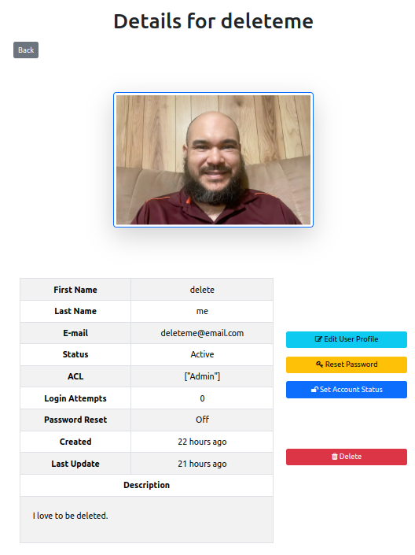

<h1 style="font-size: 50px; text-align: center;">Administration</h1>

## Table of contents
1. [Overview](#overview)
2. [Administration Dashboard](#admin-dashboard)
3. [Administration Menu](#admin-menu)

## Overview [Table of Contents](#table-of-contents)
Administration features can be accessed by any user who belongs to the admin group.  This frame work supports the ability for administrators to perform the following tasks:
1. Access the administration dashboard
2. View list of all users
3. View and edit user profiles (useful if a user violates any terms of service agreements)
4. Set the reset and unset the reset password flag for a user
5. Activate or deactivate users
6. Delete users
7. Manage Access Control Levels (ACLs)

## Administration Dashboard [Table of Contents](#table-of-contents)
The administration dashboard is easily accessible by any user in the admin group by clicking on the <q>Admin</q> link in the navigation panel.  Once at the Administration Dashboard the user is presented with a list of all users.  An example of the Administration Dashboard view is shown below in figure 1:

  
  
Figure 1 - Administration dashboard index view

# Administration Menu[Table of Contents](#table-of-contents)
When using the administration features the user has access to the Administration Menu in the navigation bar.  It contains links to the Administration Dashboard and a view for managing ACLs.  An image of the Administration Menu is shown in figure 2.

  
  
Figure 2 - Administration navbar menu

## Profile Details
When you click in the details button for a user you are sent to the administrator's profile view for a particular user.  It is similar to the view you get when visiting your own profile but includes additional features for password reset, account status, and account deletion.  You also see other details such as number of login attempts since the last successful login, status of password reset flag for the user, creation and update date information, and account status.  An example of this view is shown in figure 3.

  
  
Figure 2 - Administration view of profile

