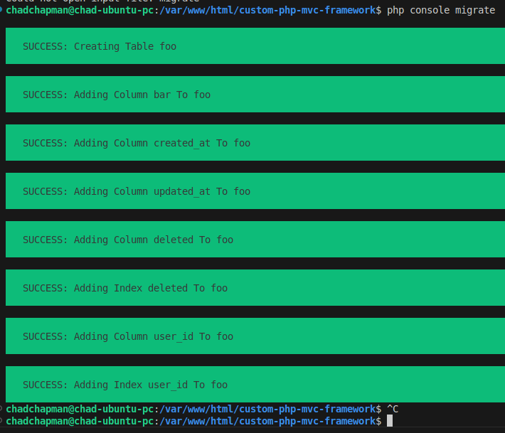
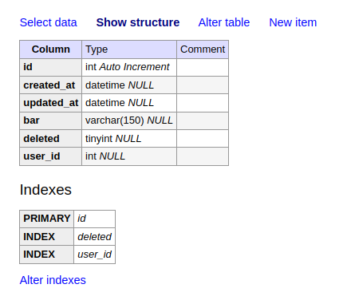

# Database Operations

## Table of contents
1. [Overview](#overview)
2. [Migration](#migration)
3. [Creating A New Migration](#creating-a-new-migration)

## Overview <span style="float: right; font-size: 14px;">[Table of Contents](#table-of-contents)</span>
This page goes over the available ways users can manage a database with chappy.php Using the console, you can perform migrations, drop tables, and other tasks. A complete description of all Migration class function can be within the project API Documentation.

## Migration <span style="float: right; font-size: 14px;">[Table of Contents](#table-of-contents)</span>
Performing a database migration is the first task you will perform after establishing a new project. Before you begin you will need to open the .env file and enter some information about the database. An example is shown below:

```
DB_NAME=my_db_name
DB_USER=my_db_user_name
DB_PASSWORD=my_secure_password
DB_HOST='127.0.0.1'
```

Next, create the database using your preferred method.  We like to use phpMyAdmin and Adminer.

Finally, you can run the migrate command shown below:

```php console migrate```

If you make a mistake or need a fresh start you can perform a refresh as described below:

```php console migrate:refresh```

Performing a the migrate and refresh commands will add a new record to a migrations table whose purpose is to track all previous migrations. When you create a one or more new migrations only those will be executed. You can also modify an existing table with a new migration. More one building your own migrations will be covered in the next section called Create Migration.

Finally, if you just want to drop tables perform the following command:

```php console migrate:drop-all```

Performing either of these commands will result in status messages being displayed in the console.

## Creating A New Migration <span style="float: right; font-size: 14px;">[Table of Contents](#table-of-contents)</span>
Create a migration by running the make:migration command. An example is shown below for a table called foo:

```php console make:migration foo```

Once you perform this action a migration class is created with two functions called up and down. Up is used to create a new table or update an existing one. Down drops an existing table. We usually don't modify the down function. The output from the previous command is shown below:

```php
namespace Database\Migrations;
use Core\Migration;

class Migration1733521897 extends Migration {
    public function up() {
        $table = 'foo';
        $this->createTable($table);
    }

    public function down() {
        $this->dropTable('foo');
    }
}
```

The up function automatically creates a $table variable set to the value you entered when you ran the make:migration command along with a function call to create the table. In the code snippet below we added some fields.

```php
namespace Database\Migrations;
use Core\Migration;

class Migration1733521897 extends Migration {
    public function up() {
        $table = 'foo';
        $this->createTable($table);
        $this->addColumn($table,'bar','varchar',['size'=>150]);
        $this->addTimeStamps($table);
        $this->addSoftDelete($table);
        $this->addColumn($table,'user_id','int');
        $this->addIndex($table,'user_id');
    }

    public function down() {
        $this->dropTable('foo');
    }
}
```

**addColumn** is the most common function that is used. On line 8 we call this function to create a field called 'bar' whose type is varchar. The last argument is the optional attributes parameter. It is an associative array and in this case we set the size. Other supported attributes are precision, scale, before, after, and definition.

**addTimeStamps** as shown on line 9 creates 'created_at' and 'updated_at' fields. **softDelete** is used as a setting where you want to removed a record from being returned from any database query. It serves as a safety net that allows you to permanently delete the record later or preserve for later use.

The function call on line 11 adds a user_id field and the next line sets this field as an index. It is a common way to create relationships with this and the Laravel framework.

Run the migration and the console output, if successful, will be shown below:

<div style="text-align: center;">
  
  <p style="font-style: italic;">Figure 1: Console output after running the migrate command.</p>
</div>

Open your database management software package and you will see that the table has been created.

<div style="text-align: center;">
  
  <p style="font-style: italic;">Figure 2 - New database table after migration was performed</p>
</div>