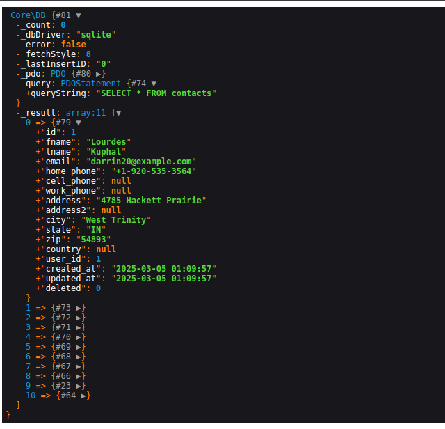
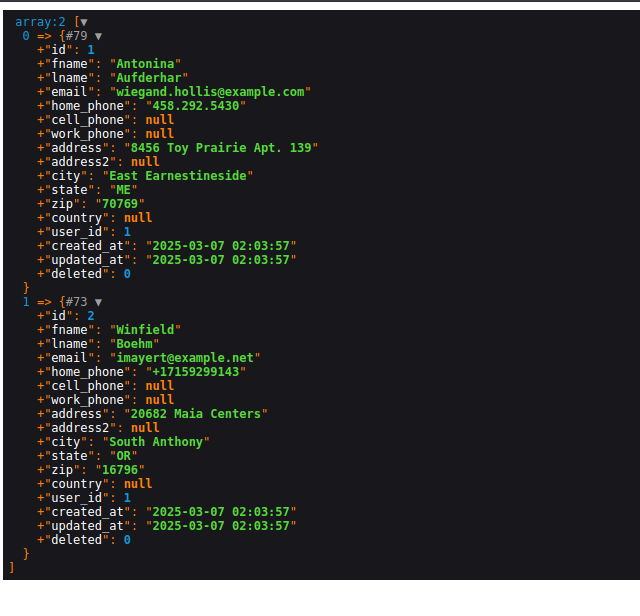

<h1 style="font-size: 50px; text-align: center;">Database Queries</h1>

## Table of contents
1. [Overview](#overview)
2. [DB Class](#db)
    * A. [Query Function](#query)
    * B. [Create](#create)
    * C. [Read](#read)
    * D. [Update](#update)
    * E. [Delete](#delete)
3. [Using Models](#models)
<br>
<br>

## 1. Overview <a id="overview"></a><span style="float: right; font-size: 14px; padding-top: 15px;">[Table of Contents](#table-of-contents)</span>
There are two ways to perform database queries in this framework.  You can use queries or the functions that comes with your models or base model classes.
<br>

## 2. DB Class <a id="db"></a><span style="float: right; font-size: 14px; padding-top: 15px;">[Table of Contents](#table-of-contents)</span>
You can perform a query within this framework by using the `query` function from the `DB` class.  The query function has 3 parameters:
1. $sql - The database query we will submit to the database.
2. $params - The values for the query.  They are the fiends of the table in our database.  The default value is an empty array.
3. $class - A default value of false, it contains the name of the class we will build based on the name of a model.

An example can be found in the findUserByAcl function from the Users model.  An example is shown below:

```php
/**
 * Retrieves a list of users who are assigned to a particular acl.
 *
 * @param string $acl The ACL we want to use in our query.
 * @return object Users who are assigned to a specific acl.
 */
public static function findUserByAcl($acl) {
    $aclName = '["'.$acl.'"]';
    return self::$_db->query("SELECT * FROM users WHERE acl = ?", [$aclName]);
}
```

All the user has to do is create a classic SQL query as the first parameter.  Since we want to find a list of ACLs we use `aclName` as the parameter that we will bind using the PDO class.  By using the built in `query` function the user does not have to be concerned with the actual binding of values or calling the execute function of the PDO class.
<br>

#### A. Query Function <a id="query">
A read Query function example:

```php
use Core\DB;
use Core\Helper;
$db = DB::getInstance();
$sql = "SELECT * FROM contacts";
$contacts = $db->query($sql);
Helper::dd($contacts);
?>
```

Below is the result using the `dd` function:

<div style="text-align: center;">
  
  <p style="font-style: italic;">Figure 1 - SQL query example</p>
</div>

As shown in Figure 1 all the information returned from the database is represented as an object.  The `PDOStatement` value has been expanded to show the actual query.  The `_result` section shows all of your contacts.

You can learn more about SQL through this [link](https://www.theodinproject.com/paths/full-stack-javascript/courses/databases) to The Odin Project's Database Course.
<br>

#### B. Create <a id="read">

<br>

#### C. Read <a id="read">
Users can perform find operations using the DB class with the `find` function using parameters such as conditions, bind, order, limit, and sort.  An example is shown below:

```php
use Core\DB;
use Core\Helper;
$db = DB::getInstance();

$contacts = $db->find('contacts', [
    'conditions' => ["user_id = ?"],
    'bind' => ['1'],
    'limit' => 2,
    'sort' => 'DESC'
]);
Helper::dd($contacts);
?>
```

<div style="text-align: center;">
  
  <p style="font-style: italic;">Figure 2 - DB Class Find Function</p>
</div>

As shown above in figure 2, we need to first specify the table.  In this case we want to look through our contacts table.  Next, we set our parameters.  Here we use the `user_id` field as the condition, bind to it the `id` of 1, limit the results to the first 2, and sort in descending order.
<br>

#### D. Update <a id="update">

<br>

#### E. Delete <a id="delete">

<br>

## 2. Using Models <a id="models"></a><span style="float: right; font-size: 14px; padding-top: 15px;">[Table of Contents](#table-of-contents)</span>