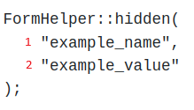
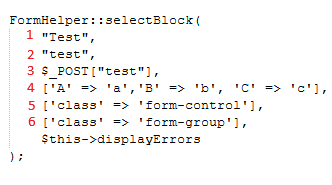

# Forms (In progress)

## Overview
The Rapid Forms feature of this Model View Controller (MVC) Framework allows the user to quickly create and style forms. This guide thoroughly describes the ability to create these HTML form elements along with a description and examples. If you would like support for additional features please create an issue [here](https://github.com/chapmancbVCU/chappy-php/issues).

## button
This function creates a button with no surrounding HTML div element. It supports the ability to set attributes such as classes and event handlers. If you want a div to surround a button along with any other attributes we recommend that you use the buttonBlock function. Note the example function call shown below in Figure 1.

<div style="text-align: center;">
  
  <p style="font-style: italic;">Figure 1 - Example button function call</p>
</div>

This function accepts 2 arguments as described below:
1. $buttonText is used to set the text of the button.
2. $inputAttrs is an array and can be found in most function calls. We use this parameter to set values for attributes such as classes for styling, front-side validation, and event handlers. Make sure when performing an event handler function call that contains strings as arguments to escape any quotes. The default value is an empty array.

## buttonBlock
The buttonBlock function is a wrapper for the button function that adds a div around the button element. An example function call is shown below in Figure 2.

<div style="text-align: center;">
  
  <p style="font-style: italic;">Figure 2 - Example buttonBlock function call</p>
</div>

This function accepts 3 arguments as described below:
1. $buttonText is used to set the text of the button.
2. $inputAttrs is an array and can be found in most function calls. We use this parameter to set values for attributes such as classes for styling, front-side validation, and event handlers. Make sure when performing an event handler function call that contains strings as arguments to escape any quotes. The default value is an empty array.
3. $divAttrs is an array whose primary purpose is to add classes for styling the div that surrounds the button element. The default value is an empty array.

## checkboxBlockLabelLeft
Generates a checkbox where the label is on the left side. It generates a div element that surrounds a label and input of type checkbox. This is idea for situations where labels can be of varying lengths. An example function call is shown below in Figure 3.

<div style="text-align: center;">
  
  <p style="font-style: italic;">Figure 3 - Example checkboxBlockLabelLeft function call</p>
</div>

This function accepts 6 arguments as described below:
1. $label is used to set the text of the label element.
2. $name sets the value for the name, for, and id attributes.
3. $value sets the value for the data received upon form submit. The default value is an empty string.
4. $checked is used to set a value of checked for a checkbox. This value can be set upon reading information from a database or upon 5. failed form validation.
5. $inputAttrs is an array and can be found in most function calls. We use this parameter to set values for attributes such as classes for styling, front-side validation, and event handlers. The default value is an empty array.
6. $divAttrs is an array whose primary purpose is to add classes for styling the div that surrounds the input element. The default value is an empty array.
7. $errors The errors array. Default value is an empty array.

## checkboxBlockLabelRight
Generates a checkbox where the label is on the left side. It generates a div element that surrounds a label and input of type checkbox. An example function call from the login view is shown below in Figure 4.
<div style="text-align: center;">
  
  <p style="font-style: italic;">Figure 4 - Example checkboxBlockLabelRight function call</p>
</div>

This function accepts 6 arguments as described below:
1. $label is used to set the text of the label element.
2. $name sets the value for the name, for, and id attributes.
3. $value sets the value for the data received upon form submit. The default value is an empty string.
4. $checked is used to set a value of checked for a checkbox. This value can be set upon reading information from a database or upon 5. failed form validation.
5. $inputAttrs is an array and can be found in most function calls. We use this parameter to set values for attributes such as classes for styling, front-side validation, and event handlers. The default value is an empty array.
6. $divAttrs is an array whose primary purpose is to add classes for styling the div that surrounds the input element. The default value is an empty array.
7. $errors The errors array. Default value is an empty array.

## csrfInput
Generates a CRSF token as the value for an input of type hidden. The token is randomly generated and is used to verify if any tampering of any form has been performed. Use this function to assist in preventing CSRF attacks. The CRSF token is unique for every user session and is a sufficiently large string of random values.

## displayErrors
The purpose of this function is to display errors related to validation. An example can be found in Figure 5.

<div style="text-align: center;">
  
  <p style="font-style: italic;">Figure 5 - Display errors example</p>
</div>

## emailBlock
Use this function to create styled E-mail form inputs. An example function call is shown below in Figure 6.

<div style="text-align: center;">
  
  <p style="font-style: italic;">Figure 6 - E-mail block example function call</p>
</div>

This function accepts 6 arguments as described below:
1. $label is used to set the text of the label element.
2. $name sets the value for the name, for, and id attributes.
The value we want to set. We can use this to set the value of the value attribute during form validation. Default value is the empty 3. string. It can be set with values during form validation and forms used for editing records.
4. $inputAttrs The values used to set the class and other attributes of the input string. The default value is an empty array.
5. $divAttrs The values used to set the class and other attributes of the surrounding div. The default value is an empty array.
6. $errors The errors array. Default value is an empty array.

## hidden
Generates a hidden element. An example function call is shown below in figure 7:

<div style="text-align: center;">
  
  <p style="font-style: italic;">Figure 7 - Hidden input function call</p>
</div>

This function accepts 2 arguments as described below:
1. $name sets the value for the name, for, and id attributes.
2. $value The value for the value attribute.

## inputBlock
1. A generic input block that supports the following input types:
2. Color
3. date
4. datetime-local
5. email
6. file
7. month
8. number
9. password
10. range
11. search
12. tel
13. text
14. time
15. url
16. week

An example function call is show below in figure 8:
<div style="text-align: center;">
  
  <p style="font-style: italic;">Figure 8 - Input block function call</p>
</div>

This function accepts 7 arguments as described below:
1. $type The input type we want to generate.
2. $label is used to set the text of the label element.
3. $name sets the value for the name, for, and id attributes.
4. $value The value we want to set. We can use this to set the value of the value attribute during form validation. Default value is the empty string. It can be set with values during form validation and forms used for editing records.
5. $inputAttrs The values used to set the class and other attributes of the input string. The default value is an empty array.
6. $divAttrs The values used to set the class and other attributes of the surrounding div. The default value is an empty array.
7. $errors The errors array. Default value is an empty array.

## output
Generates an HTML output element. The output element is a container that can inject the results of a calculator or the outcome of a user action. An example function call is shown below in figure 9:
<div style="text-align: center;">
  
  <p style="font-style: italic;">Figure 9 - Output element function call</p>
</div>

This function accepts 2 arguments as described below:
1. $name Sets the value for the name attributes for this
2. $for Sets the value for the for attribute.

## radioInput
Creates an input element of type radio with an accompanying label element. Compatible with radio button groups.  An example function call is shown below in figure 10:
<div style="text-align: center;">
  
  <p style="font-style: italic;">Figure 10 - Radio button function call</p>
</div>

This function accepts 2 arguments as described below:
1. $label Sets the label for this input.
2. $id	The id attribute for the radio input element.
3. $name	Sets the value for the name, for, and id attributes for this input.
4. $value The value we want to set. We can use this to set the value of the value attribute during form validation. Default value is the empty string. It can be set with values during form validation and forms used for editing records.
5. $checked The value for the checked attribute. If true this attribute will be set as checked="checked". The default value is false. It can be set with values during form validation and forms used for editing records.
6. $inputAttrs	The values used to set the class and other attributes of the input string. The default value is an empty array.

The example code below demonstrates how a radio button groups is used.
```php
FormHelper::radioInput('HTML', 'html', 'fav_language', "HTML", $check1, ['class' => 'form-group mr-1']); 
FormHelper::radioInput('CSS', 'css', 'fav_language', "CSS", $check2, ['class' => 'form-group mr-1']);
```

## selectBlock
Renders a select element with a list of options.  An example function call is shown below in figure 11: 
<div style="text-align: center;">
  
  <p style="font-style: italic;">Figure 11 - Select block function call</p>
</div>

This function accepts 7 arguments as described below:
1. $label Sets the label for this input.
2. $name Sets the value for the name, for, and id attributes for this input.
3. $value The value we want to set as selected.
4. $inputAttrs The values used to set the class and other attributes of the input string.  The default value is an empty array.
5. $options The list of options we will use to populate the select option dropdown.  The default value is an empty array.
6. $divAttrs The values used to set the class and other attributes of the surrounding div.  The default value is an empty array.
6. $errors The errors array.  Default value is an empty array.

## submitBlock

## submitTag

## textAreaBlock