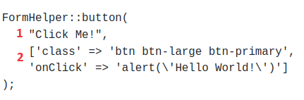

# Forms (In progress)

# Overview
The Rapid Forms feature of this Model View Controller (MVC) Framework allows the user to quickly create and style forms. This guide thoroughly describes the ability to create these HTML form elements along with a description and examples. If you would like support for additional features please create an issue [here](https://github.com/chapmancbVCU/chappy-php/issues).

# button
This function creates a button with no surrounding HTML div element. It supports the ability to set attributes such as classes and event handlers. If you want a div to surround a button along with any other attributes we recommend that you use the buttonBlock function. Note the example function call shown below in Figure 1.

  
  
Figure 1 - Example button function call

This function accepts 2 arguments as described below:
1. $buttonText is used to set the text of the button.
2. $inputAttrs is an array and can be found in most function calls. We use this parameter to set values for attributes such as classes for styling, front-side validation, and event handlers. Make sure when performing an event handler function call that contains strings as arguments to escape any quotes. The default value is an empty array.

# buttonBlock
The buttonBlock function is a wrapper for the button function that adds a div around the button element. An example function call is shown below in Figure 2.

  
  
Figure 2 - Example buttonBlock function call

This function accepts 3 arguments as described below:
1. $buttonText is used to set the text of the button.
2. $inputAttrs is an array and can be found in most function calls. We use this parameter to set values for attributes such as classes for styling, front-side validation, and event handlers. Make sure when performing an event handler function call that contains strings as arguments to escape any quotes. The default value is an empty array.
3. $divAttrs is an array whose primary purpose is to add classes for styling the div that surrounds the button element. The default value is an empty array.

# checkboxBlockLabelLeft (update screenshot and add 7th argument)
Generates a checkbox where the label is on the left side. It generates a div element that surrounds a label and input of type checkbox. This is idea for situations where labels can be of varying lengths. An example function call is shown below in Figure 3.

  
  
Figure 3 - Example checkboxBlockLabelLeft function call

This function accepts 6 arguments as described below:
1. $label is used to set the text of the label element.
2. $name sets the value for the name, for, and id attributes.
3. $value sets the value for the data received upon form submit. The default value is an empty string.
4. $checked is used to set a value of checked for a checkbox. This value can be set upon reading information from a database or upon 5. failed form validation.
5. $inputAttrs is an array and can be found in most function calls. We use this parameter to set values for attributes such as classes for styling, front-side validation, and event handlers. The default value is an empty array.
6. $divAttrs is an array whose primary purpose is to add classes for styling the div that surrounds the input element. The default value is an empty array.

# checkboxBlockLabelRight (update screenshot and add 7th argument)
Generates a checkbox where the label is on the left side. It generates a div element that surrounds a label and input of type checkbox. An example function call from the login view is shown below in Figure 4.

  
  
Figure 4 - Example checkboxBlockLabelRight function call

This function accepts 6 arguments as described below:
1. $label is used to set the text of the label element.
2. $name sets the value for the name, for, and id attributes.
3. $value sets the value for the data received upon form submit. The default value is an empty string.
4. $checked is used to set a value of checked for a checkbox. This value can be set upon reading information from a database or upon 5. failed form validation.
5. $inputAttrs is an array and can be found in most function calls. We use this parameter to set values for attributes such as classes for styling, front-side validation, and event handlers. The default value is an empty array.
6. $divAttrs is an array whose primary purpose is to add classes for styling the div that surrounds the input element. The default value is an empty array.