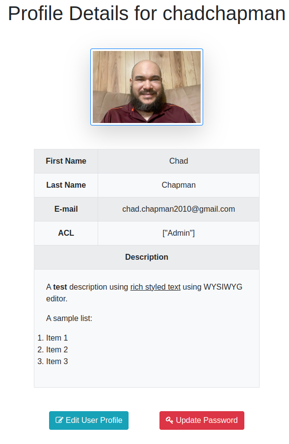
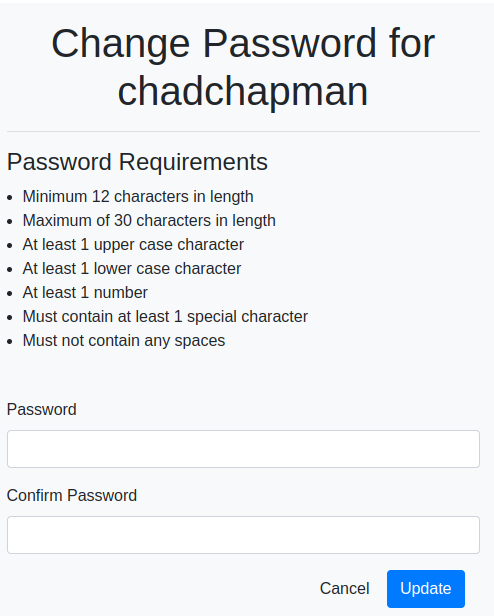

# User Profiles

## User Profile Home
The profile page can be accessed by clicking your name or profile image at the top right of any page.

The user profile contains basic information for a user. You can add fields to the users table and more information to this view depending on your needs. Make sure you don't display personal and financial information in this view without taking proper security measures to obscure information.

This view presents to the user the ability to update profile, profile image, and their password. The default layout for this view is shown below in Figure 1.

  
  
Figure 1 - User profile view

## Update Profile
At the edit profile page the user can edit their details. A screenshot is shown below in figure 2.

  
  
Figure 2 - Edit profile view

Field Descriptions:
1. First Name: User's first name and it's a required field.
2. Last Name: User's last name and it's a required field.
3. E-mail: User's Email and it's a required field
4. Description: Optional field where the user can describe themselves.
5. Upload Profile Image (Optional)
6. Manage profile images. Image on left is current image. You can drag an image to the left most position to set it as the current profile image.

## Update Password
This view allows the user to change their password. Complex passwords are enforced here. A screenshot of the update password screen is shown below in Figure 4.

  
  
Figure 3 - Change password view

