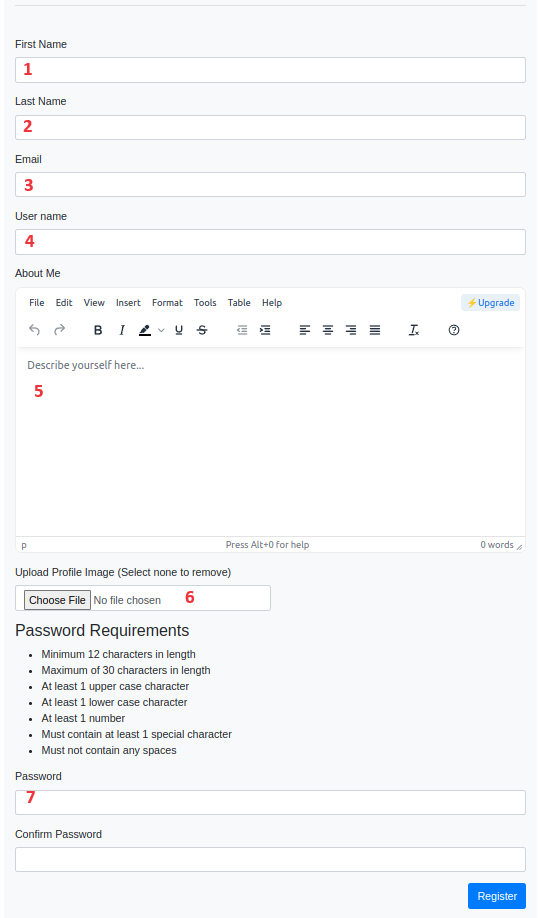

# User Registration and Authentication

## Table of contents
1. [Overview](#overview)
2. [Registration](#registration)
3. [Login](#login)

## Overview [Table of Contents](#table-of-contents)
This section provides an overview of the registration and authentication process.

## Registration [Table of Contents](#table-of-contents)
At the login page the user can access the registration page. A screenshot is shown below in figure 1.

  
  
Figure 1 - Registration view

Field Descriptions:
1. First Name: User's first name and it's a required field.
2. Last Name: User's last name and it's a required field.
3. E-mail: User's Email and it's a required field
4. User name: Your user name and it's a required field
5. Description: Optional field where the user can describe themselves.
6. Profile Image: Optional profile image.
7. Password: Make sure they match and fulfill complexity requirements.

## Login [Table of Contents](#table-of-contents)
The login page is the standard login setup with a remember me checkbox. Once you login you can access parts of the application that are allowed for your access control level. The number of failed attempts allowed can be set by your administrator. If you are an administrator and you get locked out and there are no other administrators you can set the inactive field to 0 and login_attempts to 0 in the record associated with your user account.